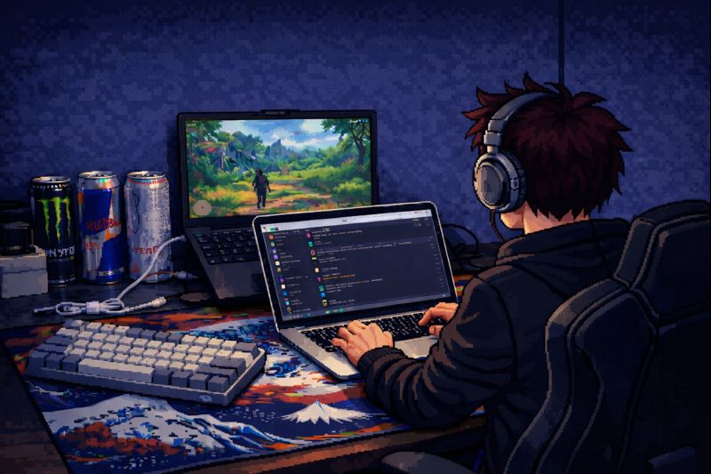

<h1 align="center">Sahil Mane</h1>

  Full-Stack Developer • DevOps

  

### About

I’m a full-stack developer who enjoys building complete applications and understanding systems end to end.
I work across frontend and backend, focusing on clean code, practical solutions, and strong fundamentals.
---

### Skills

**Frontend**  
React, Next.js, JavaScript, TypeScript, HTML, CSS

**Backend**  
Node.js, Express, REST APIs, Bun

**Databases**  
PostgreSQL, MongoDB, SQL

**Languages & Fundamentals**  
C, C++ (DSA), Swift (basic)

**DevOps & Tools**  
Git, Docker, CI/CD basics, Linux

**Other**  
Open Source Contribution, Problem Solving, System Thinking

---

### Contact

- **Email:** sahilmanecode@gmail.com  
- **LinkedIn:** https://linkedin.com/in/sahilmane74  
- **Portfolio:** https://sahil-mane-web.netlify.app  
- **GitHub:** https://github.com/sahilmane69
